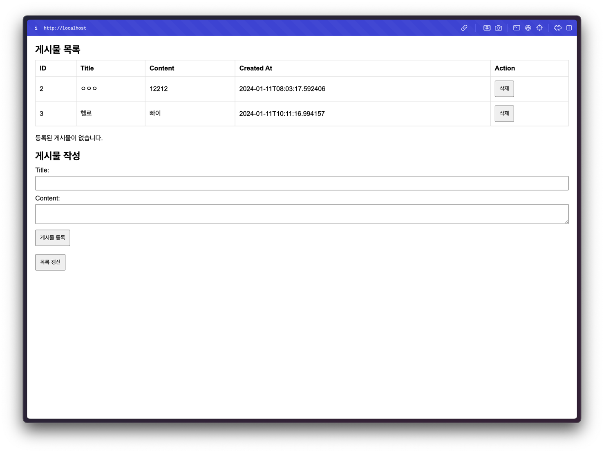

# 구름톤 트레이닝 실습 과제 1

---

구름톤 실습 과제1 제출레포지토리 입니다.


## 1. Environment

---

**OS** : MacOS(version : sonoma 14.0, Apple Silicon(M1))<br>
**Docker** : v20.10.22<br>
**docker-compose tool** : v2.15.1<br>
**Spring Boot** : v3.2.1<br>
**Postgres** : v16<br>


<br>


## 2. 프로젝트 구조

---
```bash
.
├── Dockerfile            > Spring Build & Run Dockerfile
├── docker-compose.yaml   > Spring & Postgres docker-compose file
├── .env.loacl  > local env file
├── .env.prod   > prod env file (use docker-compose)
...
├── build.gradle  > Spring build.gradle
...
└── src
    ...
    ├── WebDockerBuildApplication.java
    ├── boards  > Board API Directory 
    ...
    └── resources
    ├── application-local.yaml  > local profile
    ├── application-prod.yaml   > prod profile
    ├── application.yaml        > common profile variable
    ├── static
    ├── templates
    │   └── board.html    > RootPath HTML(thymeleaf)
    ...
```


## 3. Build

---
컨테이너 별 Dockerfile 파일 빌드와 Docker Compose 빌드 방식 두 가지에 대한 설명입니다. 
* Dockerfile 단일 빌드
  * env.local 파일에 정의하여 사용
* Docker Compose 빌드
  * env.prod 파일에 환경 변수 정의 됨
  * Spring Boot App, Postgresql 로 구성

<br>

### a. Dockerfile 단일 빌드 시

---

**Spring**에서 데이터베이스 연결이 필요하기 때문에 **Dockerfile 단일로 수행 시**, **DB** 연결이 필요합니다.
<br>

#### 1. DB(Postgres)
데이터베이스 이미지 실행
```bash
$ docker run --name task1-db -p 5432:5432 --env-file ./.env.local -d postgres:16
```
#### 2. Spring Back App
도커 파일로 실행하는 경우
```bash
$ docker build -t goorm-task1-image . 
$ docker run --name task1-spring -p 80:80 --env-file ./.env.local goorm-task1-image
```
#### 3. 환경변수
```env
POSTGRES_DB=goorm
POSTGRES_USER=player
POSTGRES_PASSWORD=playerpw
POSTGRES_HOST=host.docker.internal  > 다른 컨테이너 간 통신 시 해당 파라메터를 사용한다. 
POSTGRES_PORT=5432                  > Spring - DB 연결 포트
ACTIVE_PROFILE=local  > Spring Boot Profile Variable
```

<br>

### B. Docker Compose

---

root 경로의 .env file로 분기하였고, <br> 
Git Action 사용 시 Env Variable 변경이 용이 하도록 몇 개 변수만 빼두어 만들어두었습니다.

```bash
$ docker compose --env-file ./.env.prod up
```
* docker compose --env-file ${env file} up
  * env 환경변수 파일로 자동 적용됩니다.

<br>

## 4. Web

### Static Page

---
#### Homepage (ex, http://localhost)


<br>

## API

---

Docker 빌드용 과제 제출이 목적이므로 Pagination, Validation 등 기능은 구현되어있지 않습니다.
<br>
<br>

### Get Boards (All Boards)

---

### Header
> Uri : /api/boards <br>
Method : GET <br>
Content-Type : application/json


### Response
```
status 200 ok
[
    {
        "title": "ㅇㅇㅇ",
        "content": "12212",
        "created_at": "2024-01-11T08:03:17.592406",
        "board_id": 2
    },
    {
        "title": "헬로",
        "content": "빠이",
        "created_at": "2024-01-11T10:11:16.994157",
        "board_id": 3
    }
]
```

<br>
<br>

### Create Board (Saving one board)

---


### Header
> Uri : /api/boards <br>
Method : POST <br>
Content-Type : application/json


### Request
| key     | type   | req | limit | desc   |
|---------|--------|-----|-------|--------|
| title   | string | O   | 20    | 게시물 제목 |
| content | string | O   | 256   | 게시물 내용 |

예외처리는 되어있지 않지만, Table Column 에 Limit이 걸려있습니다.

#### Response
```
status 201 ok
```


